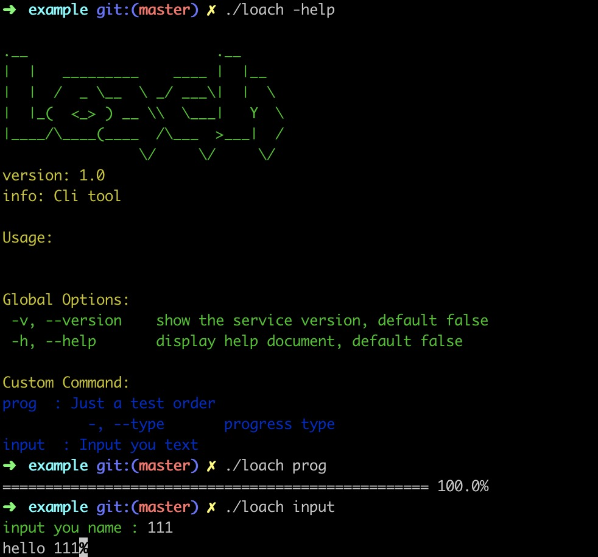

[](https://goreportcard.com/report/github.com/greatewei/loach)
# [loach](https://github.com/greatewei/loach)
Simple custom command tool. Support the progress bar display. Font color

## Feature
1. Support custom commands
2. Support custom font color
3. Support interactive command
4. Support multiple formats progress bar

## Quick start
```go
package main

import (
	"fmt"
	"github.com/greatewei/loach/app"
	"github.com/greatewei/loach/interaction"
	"github.com/greatewei/loach/progress"
	"time"
)

func main() {
	cli := app.Init(func(app *app.App) {
		app.Name = "loach"
		app.Version = "1.0"
		app.Logo = `
.__                      .__     
|  |   _________    ____ |  |__  
|  |  /  _ \__  \ _/ ___\|  |  \ 
|  |_(  <_> ) __ \\  \___|   Y  \
|____/\____(____  /\___  >___|  /
                \/     \/     \/ `
		app.Describe = "Cli tool"
	})
	type Param struct {
		a int
	}
	param := &Param{}
	_, _ = cli.AddCommand(&app.Command{
		Name:     "prog",
		Describe: "Just a test order",
		Fn: func(c *app.Command, args []string) error {
			// progress
			prog := progress.NewProgress(100, param.a)
			for i := 0; i < 100; i++ {
				time.Sleep(50 * time.Millisecond)
				prog.AddProgress(1)
			}
			return nil
		},
		Config: func(c *app.Command) {
			c.IntVar(&param.a, "type", 0, "progress type", "")
		},
	})
	_, _ = cli.AddCommand(&app.Command{
		Name:     "input",
		Describe: "Input you text",
		Fn: func(c *app.Command, args []string) error {
			// interaction
			ans, _ := interaction.ReadInput("input you name : ")
			fmt.Print("hello ", ans)
			return nil
		},
	})
	cli.Run()
}

```

## Snapshot


