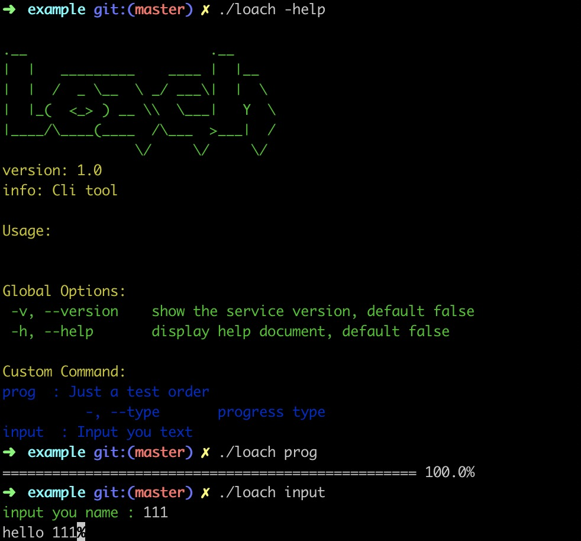

[](https://goreportcard.com/report/github.com/greatewei/loach)

# [loach](https://github.com/greatewei/loach)

Small Go library for building custom CLI tools. It helps you define commands and flags, print colored text, prompt for interactive input, and render progress bars in several styles.

Requires **Go 1.17+** (see `go.mod`).

## Features

- Custom commands with flags (`app`)
- Colored terminal output (`color`)
- Interactive prompts (`interaction`)
- Multiple progress bar styles (`progress`)

## Install

```bash
go get github.com/greatewei/loach
```

Or add the module import to your project and run `go mod tidy`:

```go
import "github.com/greatewei/loach/app"
```

## Quick start

```go
package main

import (
	"fmt"
	"time"

	"github.com/greatewei/loach/app"
	"github.com/greatewei/loach/interaction"
	"github.com/greatewei/loach/progress"
)

func main() {
	cli := app.Init(func(app *app.App) {
		app.Name = "loach"
		app.Version = "1.0"
		app.Logo = `
.__                      .__     
|  |   _________    ____ |  |__  
|  |  /  _ \__  \ _/ ___\|  |  \ 
|  |_(  <_> ) __ \\  \___|   Y  \
|____/\____(____  /\___  >___|  /
                \/     \/     \/ `
		app.Describe = "Cli tool"
	})

	type Param struct {
		a int
	}
	param := &Param{}

	_, _ = cli.AddCommand(&app.Command{
		Name:     "prog",
		Describe: "Just a test order",
		Fn: func(c *app.Command, args []string) error {
			prog := progress.NewProgress(100, param.a)
			for i := 0; i < 100; i++ {
				time.Sleep(50 * time.Millisecond)
				prog.AddProgress(1)
			}
			return nil
		},
		Config: func(c *app.Command) {
			c.IntVar(&param.a, "type", 0, "progress type", "")
		},
	})

	_, _ = cli.AddCommand(&app.Command{
		Name:     "input",
		Describe: "Input you text",
		Fn: func(c *app.Command, args []string) error {
			ans, _ := interaction.ReadInput("input you name : ")
			fmt.Print("hello ", ans)
			return nil
		},
	})

	cli.Run()
}
```

Global flags provided by `app`: `-h` / `--help`, `-v` / `--version`.

Progress styles are `progress.Type0` … `progress.Type8` (pass the int to `progress.NewProgress`).

## Example

A runnable sample lives in [`example/`](./example):

```bash
# from the repo root
go run ./example -h
go run ./example prog --type 5
go run ./example input
```

Build the example binary:

```bash
go build -o loach ./example
```

Build all packages:

```bash
go build ./...
```

Fibonacci animation demo (static HTML, no build step): open [`example/fibonacci/index.html`](./example/fibonacci/index.html) in a browser.

There are currently no automated tests in this repository.

## Project structure

```text
app/           CLI app, commands, and flags
color/         ANSI color helpers for terminal output
interaction/   Simple stdin prompts
progress/      Progress bar rendering and styles
example/       Demo CLI (same flow as Quick start)
example/fibonacci/  Static Fibonacci sequence animation page
```

## Snapshot



## License

Apache License 2.0. See [LICENSE](./LICENSE).
